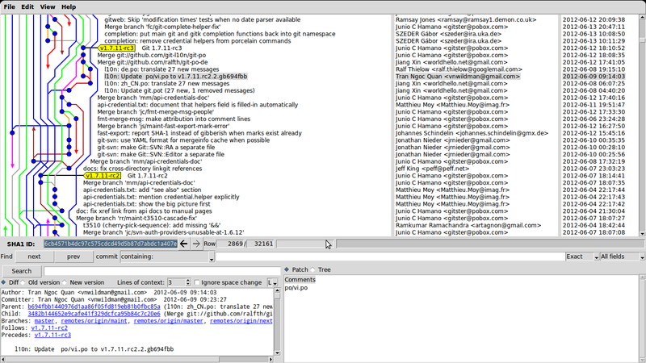
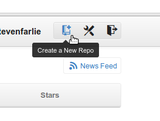
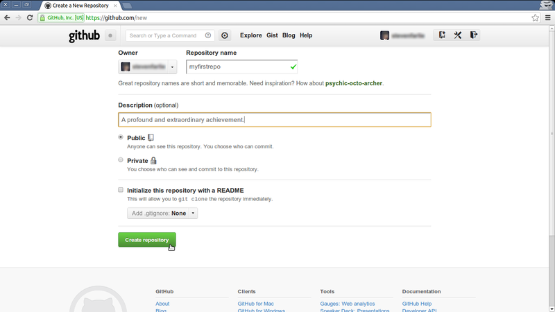
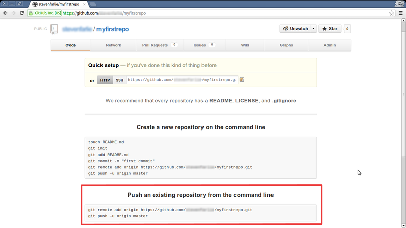

---

layout: ots
title: Your first repository

---
Note:

_All the commands will be typed in the termainal for Linux/MAc users, and on Windows, in the git bash for those who installed the official msysgit from the git website, or the git-shell if you installed the github client._

We'll be doing most of our Git actions with the command line tool. So
you'll need to open up a terminal (aka a console). You'll also need to
decide where to keep your Git repositories. In this course we use the
`$` symbol as the terminal prompt when we want you to type
something. For example:

	$ echo "Command lines are rad."
	Command lines are rad.
	
Means that you should type `echo "Command lines are rad."`. You don't
need to type the `$`.

Now, where should you keep your code? I use a Linux machine, so I have
a home directory `/home/steven` for all my files. When I'm developing
I like to keep repositories under the `dev` directory. So whenever I
want to create a new repository, I use `cd /home/steven/dev` to change
to my development directory. When I develop on OSX, the directory I
use is `/Users/steven/dev`. On Windows, it's something like
`C:\Documents and Settings\Users\Steven\dev`.

Once you have your terminal open and you have changed to your
development directory it is time to initialise your first Git
repository:

	$ git init myfirstrepo
	Initialized empty Git repository in /home/steven/dev/myfirstrepo/.git/

Git creates a directory called `myfirstrepo`. This is where you'll be keeping all
your code. Then git creates a subdirectory called `.git` which is where it keeps
all the settings and history for this repository. It starts with a dot, which means
that it is a hidden directory, to keep it out of the way of your files.

So at the moment, you have a completely blank repository that is ready to add
files. From now on, your command line will need to be inside `myfirstrepo` so
that git knows which repository to use. The `status` command in git will let you
know the current status of your repository:

	$ cd myfirstrepo
	$ git status
	# On branch master
	#
	# Initial commit
	#
	nothing to commit (create/copy files and use "git add" to track)

## Add a file

We can put any type of file into Git. It is especially good at keeping track of
text files such as Python, Javascript, HTML and CSS. A very common file is the
README, which is used to tell people what the repository is about.

Create a new file called `README` inside `myfirstrepo/` with your text editor.
You can put any text inside here. Maybe you would like something a little
mysterious? We could put some Keats in here:

    Here will I kneel, for thou redeemed hast
    My life from too thin breathing: gone and past
    Are cloudy phantasms. Caverns lone, farewel!
    And air of visions, and the monstrous swell
    Of visionary seas! No, never more
    Shall airy voices cheat me to the shore
    Of tangled wonder, breathless and aghast.

Yes, this seems suitable.

Once you have the file saved then it's time to add it to your repository. In
git, you add and remove files with the `add` and `rm` commands.

	$ git status
	# On branch master
	#
	# Initial commit
	#
	# Untracked files:
	#   (use "git add <file>..." to include in what will be committed)
	#
	#	README
	nothing added to commit but untracked files present (use "git add" to track)

Here git is saying that the README file is not being tracked. Let's add it.

	$ git add README
	$ git status
	# On branch master
	#
	# Initial commit
	#
	# Changes to be committed:
	#   (use "git rm --cached <file>..." to unstage)
	#
	#	new file:   README
	#

Ok, it's in. Now we can perform our first commit. A commit is a
snapshot of the repository at a particular point in time. Everything
we have added using the `add` command will be saved in the commit. If
you have changed the README since using `add` then you will need to
`add` it again.

For now we just want the new README file in our commit. So let's `commit` it:

	$ git commit -m "This is my first commit."
	[master (root-commit) 199b7a1] This is my first commit.
	1 file changed, 7 insertions(+)
	create mode 100644 README

And `log` will tell us that the commit is now in the repository:

	$ git log
	commit 199b7a1457ebd5c1df3cb5fde21a45b769d9c31c
	Author: Steven Farlie <steven.farlie@gmail.com>
	Date:   Mon Oct 15 15:01:26 2012 +0200

	    This is my first commit.

Git has saved a snapshot of your repository at the moment you committed. If you
will take a look at `git status` it will tell you that your directory is
currently 'clean', meaning that nothing has changed since the commit. You can
always return your directory back to any commit in your history. Likewise, you
can also fast-forward your directory to commits in your future, for example when
somebody has made a change that you would like to add to your repository. But
we'll get to that later when we discuss pulling changes from others.

## Extra fun

You can add more and more commits to your repository using the same
"add then commit" workflow. Try adding an attribution to the README
(it's John Keats from the poem
[Endymion](http://www.gutenberg.org/ebooks/24280)), or adding some
source files of your own to the repository, and committing a few
changes here and there.

# Commits are on branches

In the example, you may have noticed the word `master` several
times. In git, commits are organised into _branches_. The branch
`master` is the default branch name for a new git repository. You can
think of branches as timelines of changes.

At the moment, your repository is very simple. There is just a single
commit, and the master branch is a label that points to it. Like so:

        o  <-- master

Now say you have made some more changes. Like before you'll use _add_
and _commit_ to create a new commit. Git knows you are on the `master`
branch, so it looks at the commit `master` points to, adds your commit
to it, and points `master` to your new commit. Now you have two
commits in your repository, and the `master` branch points to the
new one.

        o---o <-- master

There isn't anything special about a `branch`. It is just a label that
we add to the latest commit you made. It's a much easier way than
typing out the identifier of the commit, which is a crazy-long unique
hash string.

## Multiple branches

We won't be getting too deep into this today, but branches become very
useful in day-to-day use by teams, as they allow you to experiment
with _topic branches_. It's like fan-fiction for developers! You can
make a branch off the official `master` branch, then if people like
them you can _merge_ the branch back into `master`. Git is very smart
about merging changes, making it very easy to use once you get the
hang of it.

It can get very complicated over time, when a project might have at
least a dozen active branches at any one time. But git is very good at
managing lots of branches. Even the git project itself has gotten a
little crazy at times with the number of branches!

# Pushing to GitHub

Now that we have this fantastic local repository, it's time to change the world
by sharing it on GitHub!

Fortunately, the process is pretty simple. We'll create a repository on GitHub
using the exact same name, then `push` our repository to GitHub. At
the end we will have two repositories: the one on your computer, and
the one at GitHub.

* Create a repository called 'myfirstrepo' on the
  [new repository page](https://github.com/new). Leave all the options
  as default.

Now, on that web page, see the section *Push an existing repository from the command line*. It
has the two key commands you'll need, tailored for your repository.

* *git remote add* associates your local repository to your GitHub repository,
  which will be called _origin_ (which is a git convention for the default
  remote repository). You could also call it _github_ or _upstream_ or anything
  you like, as it only applies to your local repository.
* *git push* pushes commits to _origin_ (GitHub) from the branch _master_ (the
  default branch). The `-u` option tells git that we want to push to a branch called _master_ on the remote repository called _origin_ as the
  default in future, so we don't have to type it every time. Our local and remote _master_ branches are now linked.

# Streamlining the process

Now that you've done it the manual way, you should know that it can be a little
easier than this. If you know at the beginning that you want to share your code
on GitHub, you can just [create a new repository](https://github.com/new), check
"Initialize this repository with a README" and `clone` the repository, like so:

	$ git clone git@github.com:stevenfarlie/myfirstrepo.git
	Cloning into 'myfirstrepo'...
	remote: Counting objects: 3, done.
	remote: Compressing objects: 100% (2/2), done.
	remote: Total 3 (delta 0), reused 3 (delta 0)
	Receiving objects: 100% (3/3), done.

Everything will be set up for you, with an initial README commit and _origin_
pointing to GitHub. If you use a graphical tool like GitHub for Mac it can be
even easier, as it will put a "Clone" button directly on GitHub website so you
don't even have to type `git clone`. These are all shortcuts for the same basic
process that you went through.
