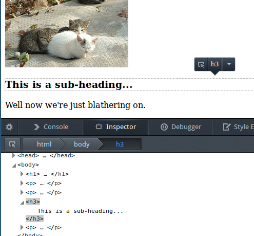

---

layout: ots
title: Browser Developer Tools

---

## Browser Consoles

The web browsers [Firefox](https://www.mozilla.org/en-US/firefox/new/)
and 
[Google Chrome](https://www.google.com/chrome) both include a browser
console 
tool which can help you create web pages.

If you're not using either of these browsers you may want to download
one 
(they're both free) and use it for some of the exercises in this
workshop.

In either browser, you can right-click any element on your page and
choose 
"*Inspect Element*" to show it in the console. It's called the
"Inspector" 
tab of the "Web Console" in Firefox and the "Elements" tab of the
"Developer 
Tools" in Chrome, but they're both basically the same. This gives you
a display of 
how the browser sees your page.

Try it with the page you've created so far, right-click something on
your page 
and choose "*Inspect Element*":

The console that pops should look like this (this is FireFox, Chrome 
is different but similar):

You can also click the little triangle arrows next to elements in the
web console 
to look inside the structure of the HTML page, and click on other HTML
elements 
to see them highlighted in the browser view.

Click around the HTML elements in the console to get a look at how
the browser processes the HTML page you created. Don't be afraid to
explore. The 
console has a lot of features so don't worry if not everything makes
sense.

When you're done, you can **close the console** by clicking the "X" on
the 
far-right end.

More information on working with the console can be found in the 
[Firefox documentation](https://developer.mozilla.org/en-US/docs/Tools/Web_Console?redirectlocale=en-US&redirectslug=Using_the_Web_Console#Opening_the_Web_Console) 
and also the
[Chrome documentation](https://developers.google.com/chrome-developer-tools/docs/console#opening_the_console).

