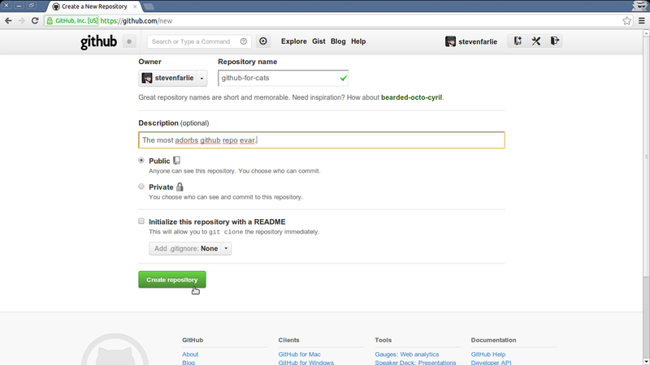
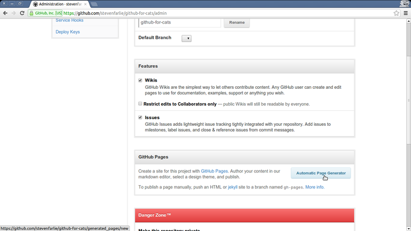
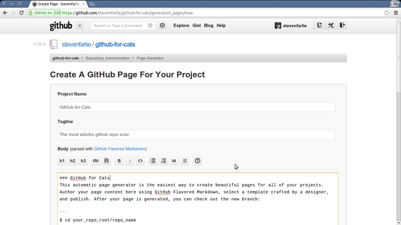
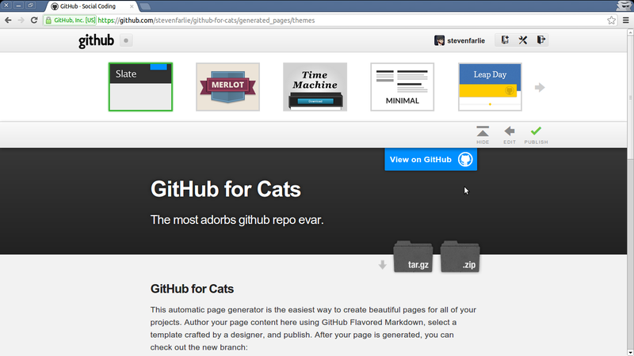
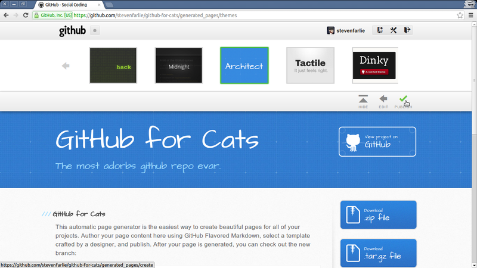
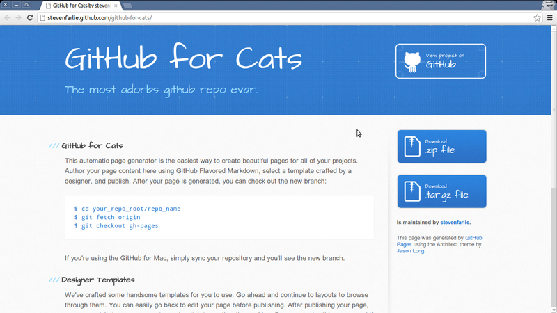

---

layout: ots
title: Hosting static websites with GitHub Pages

---

A *static website* is a website that is composed entirely of HTML, CSS
and JavaScript. There is no database or Ruby/Python code at the
server. You can't actually store anything aside from webpages.

[GitHub Pages](http://pages.github.com/) allows you to host a website
directly from your GitHub repository. Your site will then be hosted
under your own GitHub domain. For example,
[OpenTechSchool](https://github.com/OpenTechSchool) has the repository
[social-coding](https://github.com/OpenTechSchool/social-coding),
which is automatically published to
[http://opentechschool.github.com/social-coding/](http://opentechschool.github.com/social-coding/). GitHub
handling the publishing and serving of the site. All we have to do is
push to our repository on the `gh-pages` branch and GitHub will take
care of the rest.

There are a few different ways to get started with GitHub Pages, we'll
be looking at using the GitHub Pages wizard and rolling your own with
Jekyll.

# The Automatic Page Generator

GitHub provide an automated system to bootstrap an empty repository
for GitHub Pages. It allows you to pick from some premade templates so
you won't even need to clone your repository to your local machine.

Create a blank repository. Any name will do. We'll use
  `github-for-cats` as an example.

Then go to the *Admin* tab.

The generator will build just the front page for you, but you can get
a lot done here.

Then the styles are all fancy and modern and new. 

Now you can look at your site online!

Oh snap! Actually, you'll need to wait a while for the first time. But
it's worth it! After the first time it gets much quicker at
publishing.

And you're done!

# Manual Creation

You can actually make a GitHub Pages site yourself with just a blank
repository. It's just a little more work because you'll need to get
all your HTML/CSS/JS yourself and commit it to your repo.

The key thing to remember is that your site *must* be on the
`gh-pages` branch. If you commit to the `master` branch, which is the
default branch in git, then GitHub will not care. It only looks to see
if you have a `gh-pages` branch (if it watched `master` it would try
to publish almost every GitHub repo).

Start by creating a repository on GitHub and cloning it locally. Be sure
to use your **own** URL to execute the `clone` command on.

	$ git clone git@github.com:stevenfarlie/blank.git
	Cloning into 'blank'...
	warning: You appear to have cloned an empty repository.

Git is correct: we have cloned a blank repository. It doesn't even
have a branch or an initial commit. Let's start by creating a
`gh-pages` branch for the initial files:

	$ git checkout -b gh-pages
	$ git status
	# On branch gh-pages
	#
	# Initial commit
	#
	nothing to commit (create/copy files and use "git add" to track)

You can download a zip file with minimal website
[here](https://github.com/stevenfarlie/blank/zipball/gh-pages). Unzip
the files into your repository, then `add` and `commit` them.

	$ git add index.html site.css site.js
	$ git commit -m "Basic GitHub Pages site"
	[gh-pages (root-commit) 60ce662] Basic GitHub Pages site
	 3 files changed, 46 insertions(+)
	 create mode 100644 index.html
	 create mode 100644 site.css
	 create mode 100644 site.js

Now we can `push` to GitHub, but remember that we are pushing to
`gh-pages`, which doesn't exist yet on our GitHub repository

	$ git push origin gh-pages
	Counting objects: 5, done.
	Delta compression using up to 2 threads.
	Compressing objects: 100% (5/5), done.
	Writing objects: 100% (5/5), 989 bytes, done.
	Total 5 (delta 0), reused 0 (delta 0)
	To git@github.com:stevenfarlie/whatever.git
	 * [new branch]      gh-pages -> gh-pages

And bask in the glorious result! You'll find your site published at:

	http://yourusername.github.com/repo-name
	
# Jekyll - A little more dynamic

Things get even fancier with [Jekyll](http://jekyllrb.com). GitHub has
[native Jekyll support](https://help.github.com/articles/using-jekyll-with-pages). It
let's you write pages in Markdown with simple templating and support
for blog posts. It's what we use at OpenTechSchool for our blog.

You'll need a Ruby setup to get the most out of it, and at least the
`jekyll` gem installed. Maciakl has provided a simple Jekyll template
[here](https://github.com/maciakl/Sample-Jekyll-Site) which you can
use to get started. But be careful to switch to the `gh-pages` branch,
because their repository is using `master`.
