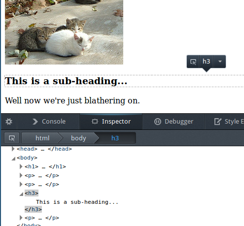

Helpful tools for HTML/CSS creation
===================================

Browser Consoles
----------------

The web browsers
`Firefox <https://www.mozilla.org/en-US/firefox/new/>`__ and `Google
Chrome <https://www.google.com/chrome>`__ both include a browser console
tool which can help you create web pages.

If you're not using either of these browsers you may want to download
one (they're both free) and use it for some of the exercises in this
workshop.

In either browser, you can right-click any element on your page and
choose "*Inspect Element*\ " to show it in the console. It's called the
"Inspector" tab of the "Web Console" in Firefox and the "Elements" tab
of the "Developer Tools" in Chrome, but they're both basically the same.
This gives you a display of how the browser sees your page.

Try it with the page you've created so far, right-click something on
your page and choose "*Inspect Element*\ ":

The console that pops should look like this (this is FireFox, Chrome is
different but similar):

You can also click the little triangle arrows next to elements in the
web console to look inside the structure of the HTML page, and click on
other HTML elements to see them highlighted in the browser view.

Click around the HTML elements in the console to get a look at how the
browser processes the HTML page you created. Don't be afraid to explore.
The console has a lot of features so don't worry if not everything makes
sense.

When you're done, you can **close the console** by clicking the "X" on
the far-right end.

More information on working with the console can be found in the
`Firefox
documentation <https://developer.mozilla.org/en-US/docs/Tools/Web_Console?redirectlocale=en-US&redirectslug=Using_the_Web_Console#Opening_the_Web_Console>`__
and also the `Chrome
documentation <https://developers.google.com/chrome-developer-tools/docs/console#opening_the_console>`__.
